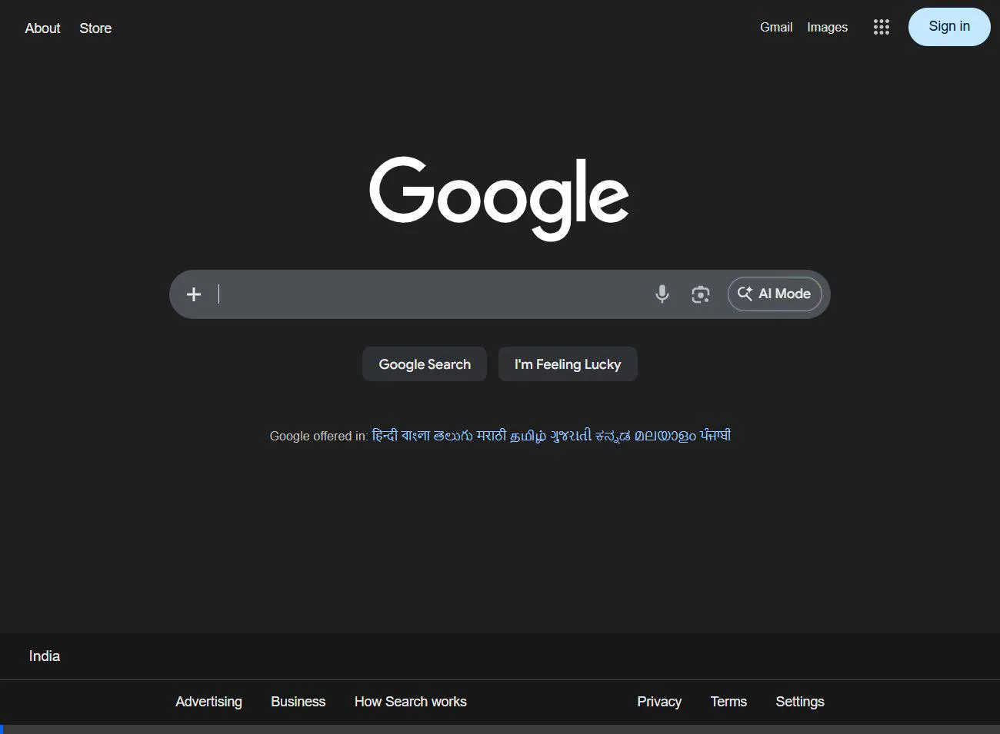
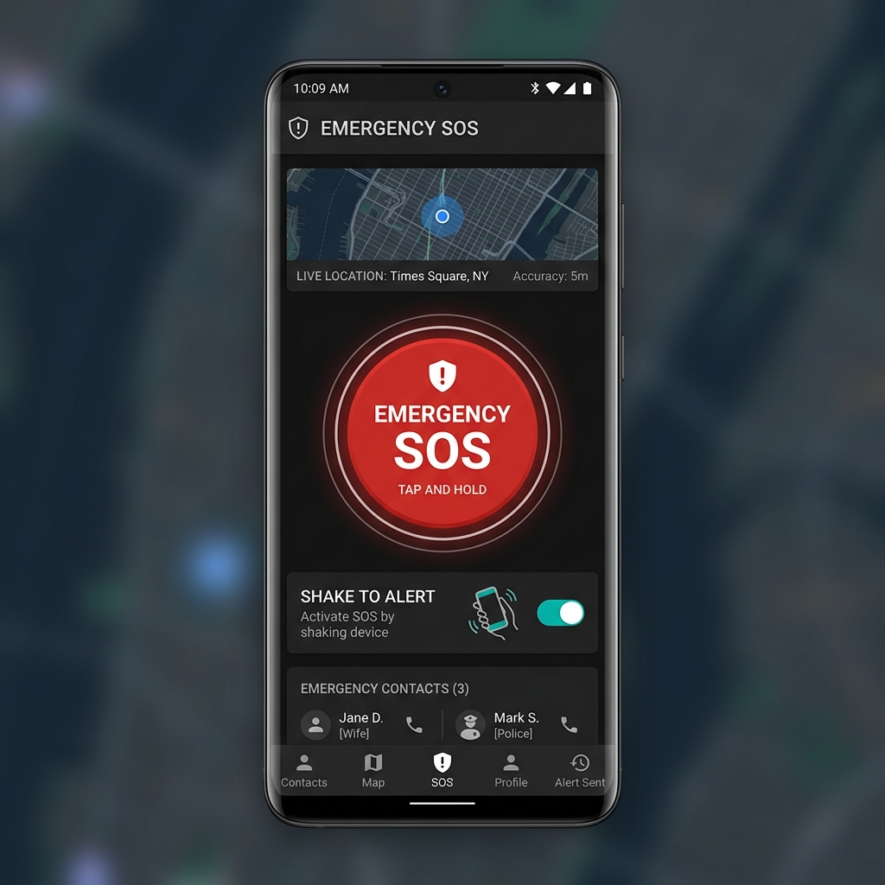
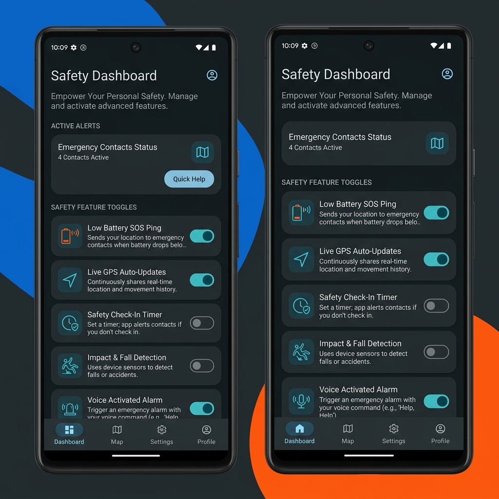

# 🚨 AnomX 

**Your Personal Emergency Response System**  
*Strips away the noise, focusing purely on rapid, life-saving communication.*

 

 
 

### Witness AnomX in Action:

---

## ⚡ What is AnomX?

**AnomX** is a highly-optimized Android application designed for ultimate personal safety. In emergency scenarios, every second counts. AnomX removes complex navigation, granting instant access to emergency broadcasting tools ranging from hardware shake-detection to live GPS tracking.

## 🛡️ Core Arsenal

| Feature | Description |
| :--- | :--- |
| **🚀 One-Tap SOS** | Push the massive `EMERGENCY SOS` button to immediately broadcast your status and real-time Google Maps coordinates to your trusted contacts via encrypted WhatsApp or raw SMS. |
| **📳 Shake to Alert** | Phone in your pocket? Simply shake the device rapidly twice. AnomX’s background service catches the physical anomaly and triggers a distress signal covertly. |
| **📍 Live Cartography** | A real-time updating map feeds your exact coordinate data straight to the dashboard, ensuring you always know where you are before broadcasting. |
| **📞 National Directory** | An offline dictionary of localized and national emergency services right at your fingertips. |

## 🧬 Advanced Modules

Dive into the **Extra Features** dashboard to turn your device into an autonomous beacon:

- **🔋 Low Battery SOS Ping:**  
  *Status:*🟢 Active  
  When your device detects battery levels dropping into critical territory, AnomX fires a final autonomous SOS containing your last-known coordinates before the phone dies.

- **📡 Live GPS Auto-Updates:**  
  *Status:*🔴 In Development  
  Once an SOS is triggered, this module locks onto your movement, firing continuous coordinate pings to your emergency contacts on a rolling interval.

## 🖼️ UI & Aesthetics

Designed with a strict, dark-mode Material UI aesthetic emphasizing high-contrast readability in high-stress situations.

  
| **Main Mission Control** | **Advanced Telemetry** |
| :---: | :---: |
|  |  |

## 🛠 Setup & Launch

It’s incredibly simple to arm the system:

1. **Add Your Defenders:** Access the dashboard and input the phone number of a trusted friend, family member, or guardian.
2. **Choose the Bridge:** Select either raw `SMS Mode` for maximum reliability or `WhatsApp` for rich-text and encryption.
3. **Arm the Sensors:** Toggle `Shake to Alert` to ON.
4. **Survive:** You are now protected by AnomX.

### Technical Requirements
* **API Target:** Built for cutting-edge Android 12+ 
* **Core Permissions:**  
  - 📍 `ACCESS_FINE_LOCATION`  
  - 💬 `SEND_SMS`  
  - 🌐 `INTERNET`

---

  <i>"Built by Eurt-labs to protect those who need it most."</i>

